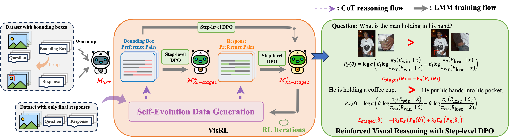

# VirRL: Intention-Driven Visual Perception via Reinforced Reasoning
[](https://arxiv.org/pdf/2408.08568)
[](https://drive.google.com/drive/folders/1CK9qihI2yyxkuXsxSHqzTRhLdTk8qghn?usp=sharing)

## Instruction
Visual understanding is inherently intention-driven—humans selectively focus on different regions of a scene based on their goals. Recent advances in large multimodal models (LMMs) enable flexible expression of such intentions through natural language, allowing queries to guide visual reasoning processes. Frameworks like Visual Chain-of-Thought have demonstrated the benefit of incorporating explicit reasoning steps, where the model predicts a focus region before answering a query. However, existing approaches rely heavily on supervised training with annotated intermediate bounding boxes, which severely limits scalability due to the combinatorial explosion of intention-region pairs. To overcome this limitation, we propose VisRL, the first framework that applies reinforcement learning (RL) to the problem of intention-driven visual perception. VisRL optimizes the entire visual reasoning process using only reward signals. By treating intermediate focus selection as a internal decision optimized through trial-and-error, our method eliminates the need for costly region annotations while aligning more closely with how humans learn to perceive the world. Extensive experiments across multiple benchmarks show that VisRL consistently outperforms strong baselines, demonstrating both its effectiveness and its strong generalization across different LMMs.

## Method overview


## Env Setup
```bash
cd VisRL
conda create -n visrl python=3.10
pip install -e ".[torch,metrics]"
```

## Data
### Data preparation
We use some of the data from VisCoT, you can download the cot data folder from [here](https://huggingface.co/datasets/deepcs233/Visual-CoT)

After downloading the data, place it in the corresponding directory and use scripts under `preprocess` to construct the SFT data and perform the initial processing of the RL data. Note that the RL data needs to be further processed using `data_gen` to generate the complete dataset.

### Data Generation
As shown in the figure, we give the pipeline for self-evolution data generation! You can simply use scripts under `data_gen` to get preference data from VQA. Specifically, first using `generate.py` and then `filter.py`.


* Remark: After dataset preparation and generation, you can place the data (both image and json files) under `data`, change the `dataset_info.json` in certain format. (We have already give you some examples demo.)

## Training
### Trainning Config
You can change the traininng configs in `configs`, including training methods, hyperparameter, etc.

### SFT Trainning
First, we use SFT with bounding box to warm up the model.
```bash
visrl-cli train configs/train_sft.yaml
```

### VisRL Trainning
Then, we conduct the training of our VisRL divided into two stages.
#### stage1
```bash
visrl-cli train configs/train_rl.yaml
```
#### stage2 
Here, use visrl-cli-stage2 instead of visrl-cli. See `src/visrl_stage2` for source code and weights.
```bash
visrl-cli-stage2 train configs/train_rl.yaml
```
* Remark: Remember to change the dataset in train_rl.yaml (e.g. demo_rl_data_stage1 for stage1, while demo_rl_data_stage2 for stage2). As our repo changes from LLaMA-Factory, we support all kinds of methods as well as base models detailed in [LLaMA-Factory](https://github.com/hiyouga/LLaMA-Factory), like KTO, PP, etc..

### Merge the weight
Remember to merge the weight after each trainning phases.
```bash
visrl-cli export configs/merge_lora.yaml
```

## Inference
You can selectively choose VLLM/Huggingface for inferencing.
```bash
API_PORT=8000 visrl-cli api configs/infer.yaml
```

## Evaluation
1. We following the Visual-CoT to conduct the eval of both performance and detection ability. refer to Evaluation Part of [Visual-CoT](https://github.com/deepcs233/Visual-CoT), that is: performance in [scripts/v1_5/eval/cot_benchmark.sh, scripts/v1_5/eval/cot_score.sh], detection in [tools/cot_detection_get_result.py, scripts/v1_5/eval/refcoco.sh], etc..
2. For qualitative results, you can refer to `infer.py` in `viscot_infer` to load the ckpt and shown how the performance.

## Acknowledgement
This repo is changed from [LLaMA-Factory](https://github.com/hiyouga/LLaMA-Factory). 
The repo also benifits form [Visual-CoT](https://github.com/deepcs233/Visual-CoT), [LLaVA](https://github.com/haotian-liu/LLaVA)

Thanks for their wonderful works.